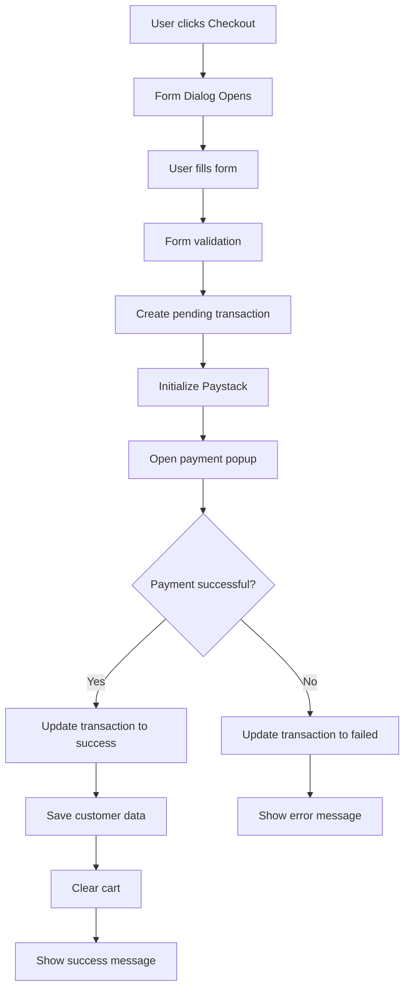

# Checkout Implementation

This document explains the checkout flow implementation with Paystack payment integration and Firestore data persistence.

## Features

1. **Customer Information Form**: Collects essential delivery information
   - Full Name
   - Email Address
   - Phone Number
   - Delivery Location

2. **Paystack Payment Integration**: Secure payment processing
   - Dynamic amount calculation with tax
   - Currency support (GHS)
   - Real-time payment status updates

3. **Firestore Data Persistence**:
   - Transactions collection: Records all payment attempts
   - Customers collection: Stores customer delivery information
   - Real-time status updates for successful/failed transactions

## Setup Instructions

### 1. Environment Variables

Create a `.env.local` file in the client directory with the following variables:

```env
# Firebase Configuration
NEXT_PUBLIC_FIREBASE_API_KEY=your_firebase_api_key
NEXT_PUBLIC_FIREBASE_AUTH_DOMAIN=your_project.firebaseapp.com
NEXT_PUBLIC_FIREBASE_PROJECT_ID=your_project_id
NEXT_PUBLIC_FIREBASE_STORAGE_BUCKET=your_project.appspot.com
NEXT_PUBLIC_FIREBASE_MESSAGING_SENDER_ID=your_messaging_sender_id
NEXT_PUBLIC_FIREBASE_APP_ID=your_app_id
NEXT_PUBLIC_FIREBASE_MEASUREMENT_ID=your_measurement_id

# Paystack Configuration
NEXT_PUBLIC_PAYSTACK_PUBLIC_KEY=pk_test_your_paystack_public_key
```

### 2. Paystack Setup

1. Sign up at [Paystack](https://paystack.com/)
2. Get your public key from the dashboard
3. Add the public key to your environment variables
4. For production, replace `pk_test_` with `pk_live_`

### 3. Firestore Collections

The system will automatically create the following collections:

#### Transactions Collection
```typescript
{
  id: string,
  reference: string,
  amount: number,
  currency: string,
  status: 'success' | 'failed' | 'pending',
  customerData: {
    fullName: string,
    email: string,
    phoneNumber: string,
    location: string
  },
  cartItems: Array<{
    productId: string,
    productName: string,
    size: string,
    quantity: number,
    price: number,
    total: number
  }>,
  subtotal: number,
  tax: number,
  total: number,
  createdAt: string,
  updatedAt: string
}
```

#### Customers Collection
```typescript
{
  fullName: string,
  email: string, // Used as document ID
  phoneNumber: string,
  location: string,
  createdAt: string,
  updatedAt: string
}
```

## How It Works

### 1. Checkout Process

1. User clicks "Checkout" button in cart
2. CheckoutDialog opens with form
3. User fills in delivery information
4. Form validation ensures all fields are properly filled
5. Transaction is created in Firestore with "pending" status
6. Paystack payment popup opens
7. User completes payment
8. Transaction status is updated based on payment result
9. If successful, customer data is saved and cart is cleared

### 2. Payment Flow



### 3. Error Handling

- Network errors during transaction creation
- Paystack initialization failures
- Payment processing errors
- Firestore write failures

All errors are logged and user-friendly messages are displayed.

## Testing

### Test Mode
Use Paystack test keys for development:
- Public Key: `pk_test_xxxxx`
- Test card numbers are available in Paystack documentation

### Production
- Replace test keys with live keys
- Test with small amounts first
- Monitor transactions in Paystack dashboard

## Security Considerations

1. **Environment Variables**: Never commit API keys to version control
2. **Client-side Validation**: Form validation prevents invalid data submission
3. **Transaction Verification**: Consider implementing webhook verification for production
4. **Firestore Rules**: Set up proper security rules for your collections

## Dependencies

- `@paystack/inline-js`: Paystack payment integration
- `react-hook-form`: Form handling and validation
- `@hookform/resolvers`: Form validation resolvers
- `zod`: Schema validation
- `firebase`: Firestore database operations

## Troubleshooting

### Common Issues

1. **Paystack not loading**: Check if public key is correct and internet connection
2. **Firestore permission denied**: Verify Firebase configuration and security rules
3. **Form validation errors**: Check Zod schema matches form requirements
4. **Payment popup not opening**: Ensure Paystack script is loaded properly

### Debug Mode

Add console logs in development:
```typescript
console.log('Transaction ID:', transactionId);
console.log('Payment response:', response);
``` 